# Sprocket-Central-Customer-Analysis

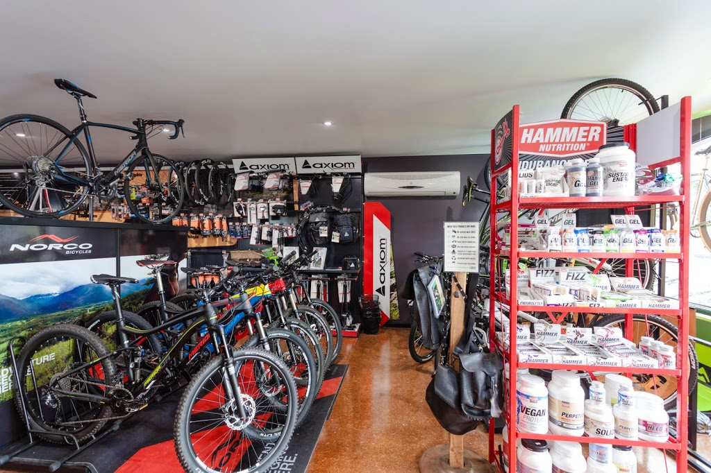

This is an Excel Project on customer analysis of **Sprocket Central Pty ltd**.  Sprocket Central specialize in high quality Bikes and cycling accessories.

**Disclaimer** : All datasets and report do not represent any company, institution or country but a dummy dataset obtain from KPMG virtual internship program to demonstrate compatibility of Excel_

## Problem Statements

1.	Identify all data quality issues.
2.	Create a PowerPoint presentation outline the approach to be taking to identify the top 1000 customer Sprocket Central Pty Ltd should target.
3.	Who are the top 1000 customers Sprocket Central should target to increase her business revenue.

## Skill and concept demonstrated.

The following Excel features were incorporated.

_DAX
_quickmeasuring
_navigation
_sort and filter
_find and replace
_tooltips

## Dataset

The dataset comprise of 3 pages

1.Transaction
2. CustomerAddress Demographic 
3. CustomerDemographic 

Below are the full explanation of data quality issues discovered, method of solution used and recommendation. Recommendation is included to avoid this issues in the future.

**Accuracy**: DOB was inaccurate for customer demographic and missing an age column, missing profit column for transaction.

•	Solution: filtered out outlier in DOB

•	Recommendation: Create an age column, allowing to process the data faster and easier to check error. Create profit column in accuracy analysis. Creation additional column for age and profit  will allow easier identification of error. 

**Completeness**: Additional customer id was inconsistent among customer demographic, customer address, Transaction

•	Solution: filter out all customer id

•	Recommendation: Ensure table are up to date

Blanks in job title for customer demographic, in online order and brand column in transaction.

•	Solution: Filtered out all M as male, filter all F and femal as Female under Gender. Filter all New South Wales to NSW and Victoria to VIC under state.

**Currency**: People that are Y in deceased indicator are not current customer for customer demographic

•	Solution: filter out customer checked Y in deceased indicator

•	Recommendation: update data accordingly as it is received.

**Relevancy**: Lack of relevancy in default column for Customer Demographic and order status for transaction

•	Solution: Deleted default column

•	Recommendation: check for incompatibility data and filter or delete to make it compatible

**Validity**: Format of list price, product sale, date for transaction.

•	Solution: Format product sale, date to short formart, format list price to currency

•	Recommendation: set up column to short date format to eliminate decimal point.

## Transaction dataset before and after data cleaning
 
Given Transaction dataset                  |               Cleaned Transaction dataset

: ----------------------------------------------:|:-------------------------------------------------: 
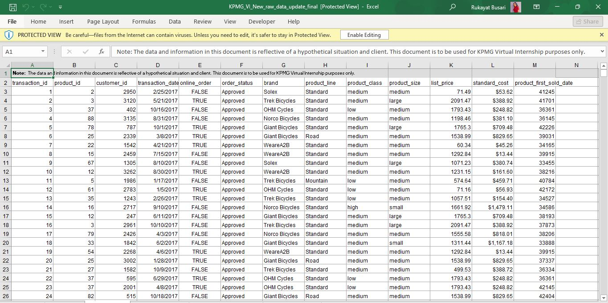|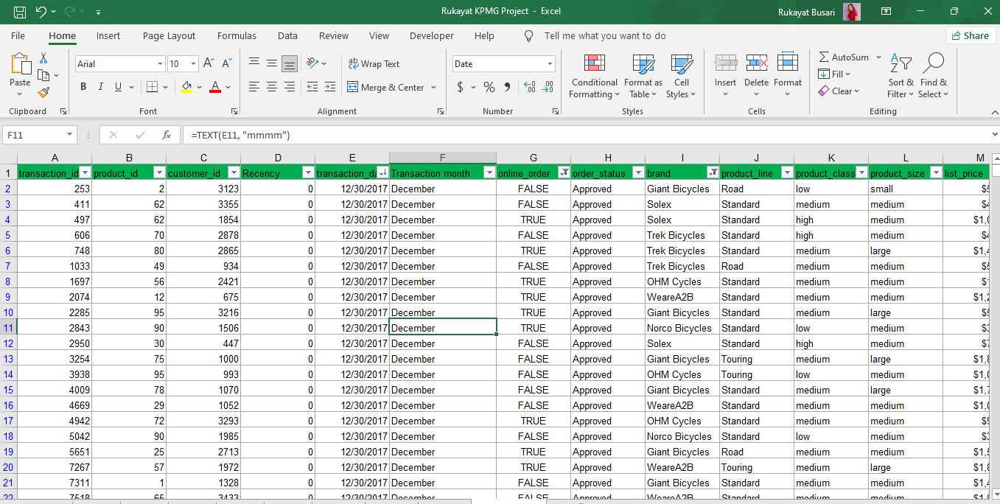

## CustomerAddress dataset before and after data cleaning
 
Given CustomerAddress dataset                  |               Cleaned  CustomerAddress dataset

: ----------------------------------------------: | :-------------------------------------------------:

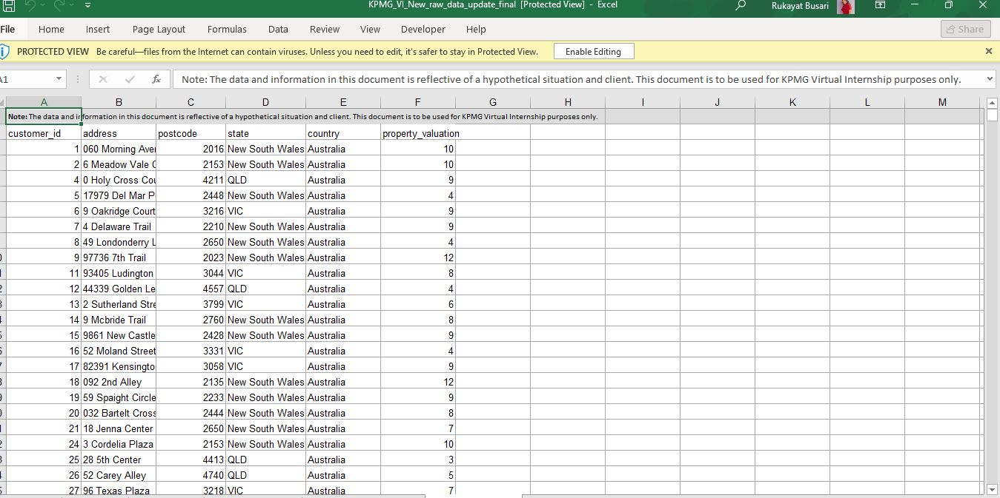    |  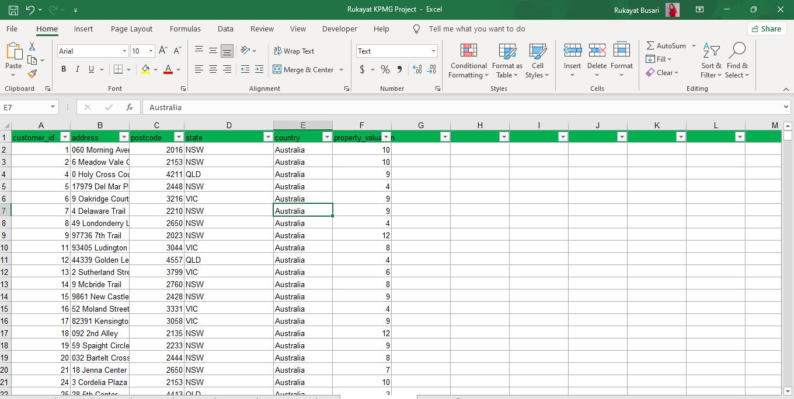

## CustomerDemographic dataset before and after data cleaning
 
Given CustomerDemographic dataset                  |               Cleaned CustomerDemographic dataset

: ---------------------------------------------- : | :-------------------------------------------------:

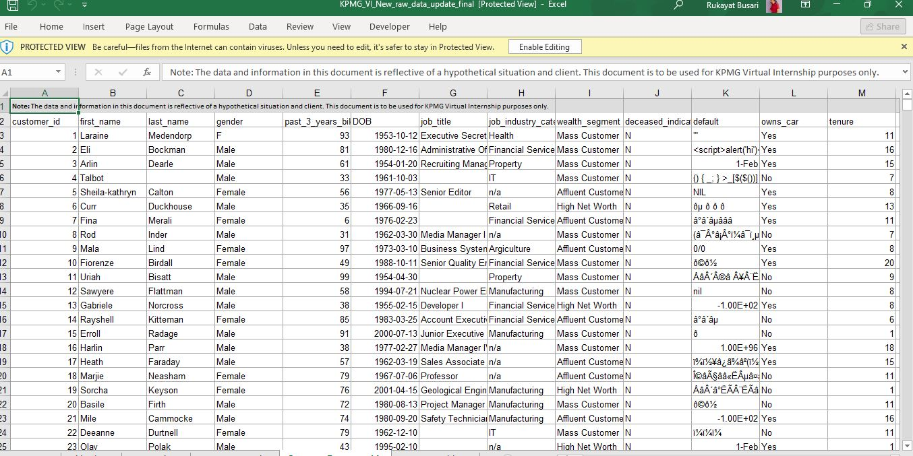       |  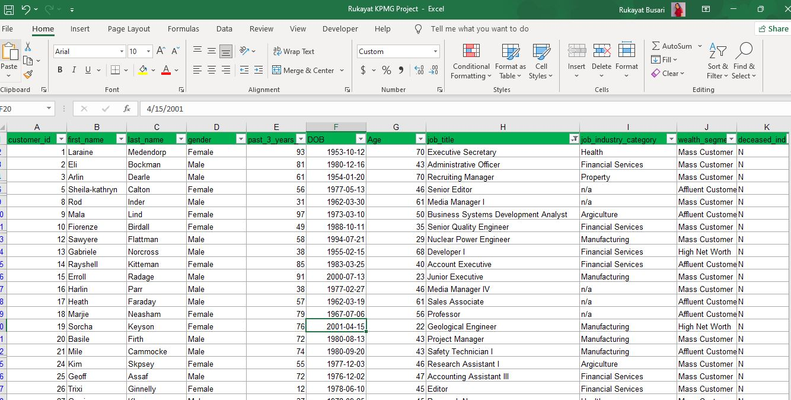 

## PowerPoint Presentation

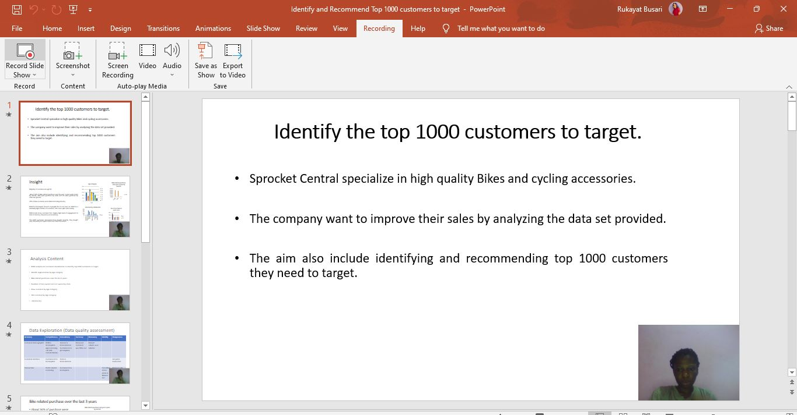

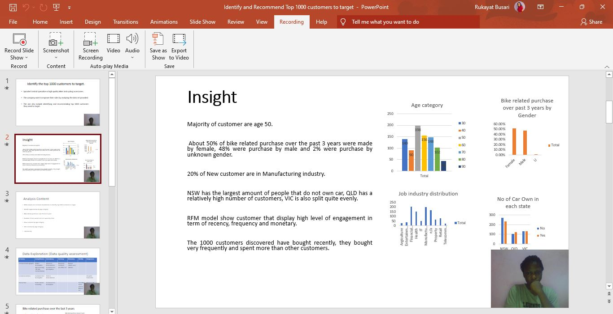

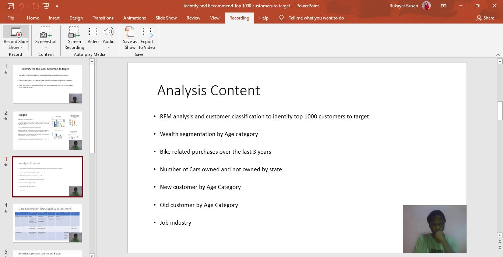

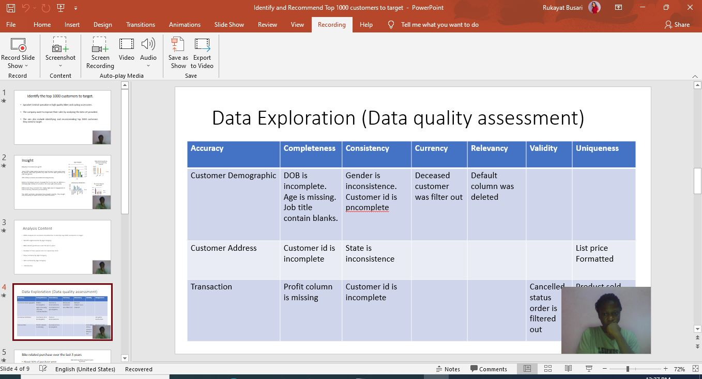

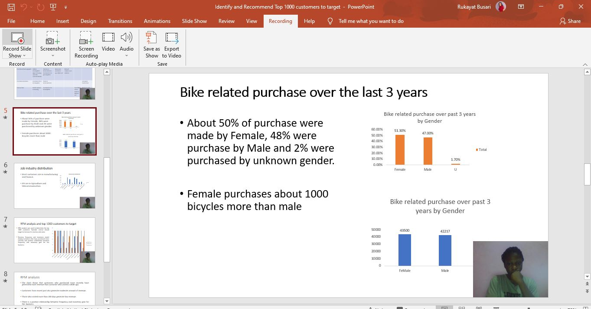

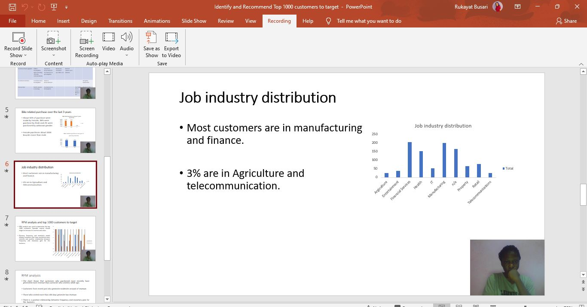

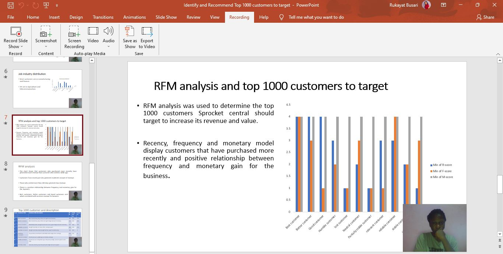

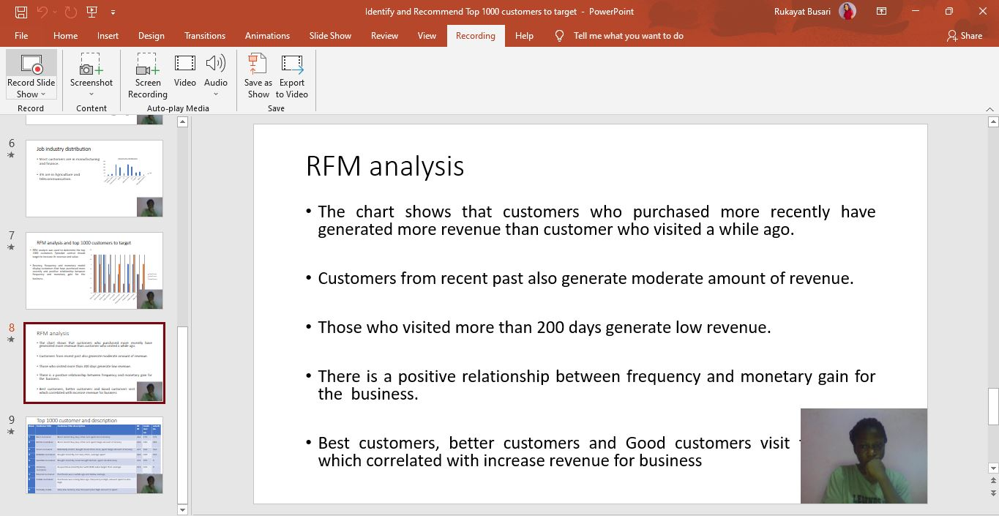

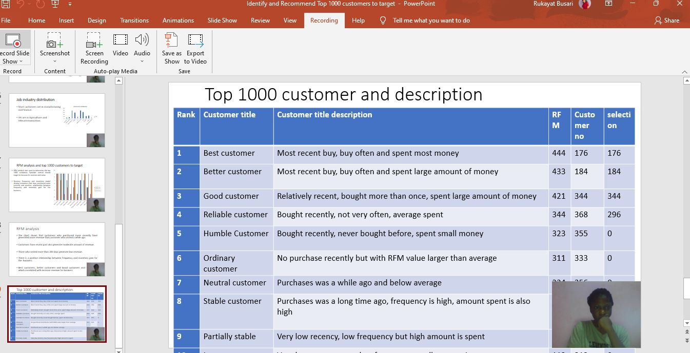

## Dashboard

 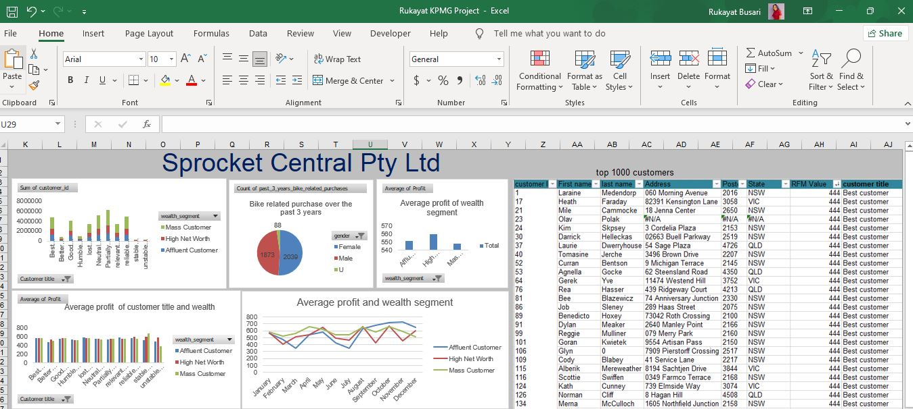
 
The chart shows that Best customers generated more revenue than other customer.

Female purchases about 1000 bicycles more than male.

The company earn more profit from mass customer in wealth segment.

There is intermittent rise and fall in the profit earn by wealth segment every month.

## Conclusion and  Recommendation

 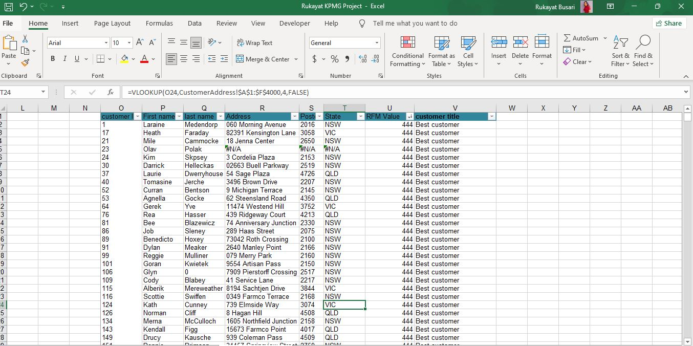

The top 1000 customers Sprocket Central Pty Ltd identify and recommend consist of customers from  Best customers, Better customer, Good customer and Reliable customer in the customer title.

Best customers has the most recent buy, buy often, spent most money and consist of 176 customers

Better customer has the most recent buy, buy often and spent large amount of money consist of 184 customers.

Good customer is relatively recent, bought more than once, spent large amount of money consist of 344 customers.

Reliable customer bought recently, not very often, average spent consist of 368 customers of which 296 were selected.

